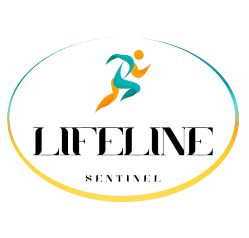

  

# LifeLine Sentinel

**AI Safety & Performance Coach for Extreme Sports Athletes**

**LifeLine Sentinel** is an AI-powered system for real-time safety, performance guidance, and off-grid monitoring during ultra-endurance events. It combines wearable vitals, smartphone edge analytics, precise GNSS (Galileo/EGNOS), and satellite fallback messaging to detect risks such as **heat stress, dehydration, overexertion, and falls** – even in remote areas with no mobile coverage.

---

## 🚩 Problem

Endurance events like ultramarathons often take place in remote, high-risk environments (heat, elevation, sleep deprivation) with limited connectivity. Crews and organizers lack real-time data to anticipate problems, while athletes may miss early signs of exhaustion or collapse. Existing wearables rarely offer personalized, reliable off-grid safety support.

---

## 🧑‍🚀 Who It's For

- **Athletes**: real-time coaching and automatic risk alerts (hydration, cooling, SOS).
- **Crews**: live location, risk score (0–100), and suggested interventions.
- **Organizers/medics**: full-course monitoring, alerts, and heatmap-based triage.
- **Insurers & venues**: risk reduction and documented event safety.

---

## 🌐 Key Technologies

- **Galileo + EGNOS**: high-accuracy, integrity-assured GNSS positioning.
- **Copernicus**: terrain (DEM) and atmospheric data for contextual risk.
- **BLE Sensors**: HR/HRV, skin temperature, SpO₂.
- **Edge AI**: risk estimation on-device with privacy-first design.
- **Satellite fallback**: Iridium SBD-style messages when offline.

---

## 🧠 How It Works

- **Athlete smartphone app** collects sensor and GNSS data, computes personalized **Risk Score**, and sends alerts via cellular or satellite.
- **Crew dashboard** shows real-time positions, alerts, and terrain overlays.
- **Backend** enriches data with terrain (DEM), validates positioning integrity, and routes alerts.

Risk detection includes:
- **Heat stress**
- **Overexertion**
- **Fall/SOS (with IMU-based detection)**

---

## 🛠️ MVP Features (Hackathon Demo)

- Mobile app with simulated BLE data, GNSS tracking, and risk visualization.
- Dashboard with live athlete map, alert queue, and action tips.
- Demo scenarios: heat stress and fall + no-movement detection.

---

## 📡 Space Assets Used

- **Galileo / EGNOS** for GNSS with integrity flags (Europe).
- **Copernicus** GLO-30 DEM and atmospheric overlays.
- **Satellite IoT** for off-grid transmission (compressed JSON burst every 60–120s).

---

## 🔒 Privacy & Safety by Design

- On-device AI by default.
- Minimal data sent: position + risk.
- Explicit consent, opt-in analytics.
- Not a medical device; advisory only.

---

## 🧭 Roadmap

- 📍 Pilot with trail clubs and live sensor tests.
- ⚙️ Hardware integration (HR chest straps, skin temp patches).
- 🛰️ Display EGNOS integrity and evaluate Galileo HAS for cm-level tracking.
- 📊 Model v2 with semi-supervised personalization and WBGT heat index.
- 🏕️ "Coach Mode" and "Group Safety Mode" for training and expeditions.

---

## 🤝 Partners & Business Model

- B2B2C with race organizers and insurers.
- Optional athlete device rental kits.
- Collaboration with GNSS OEMs, satellite providers, and sports medicine experts.

---

**Made for the Cassini Hackathon • November 2025**

> *"Because safety shouldn't end where cell coverage does."*
